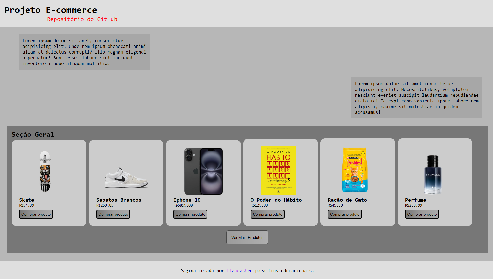

# e-commerce

## 🤷🏻 O que é
Projeto prático de E-Commerce feito com **HTML5** **CSS3** e **JavaScript**.
É um projeto *simples e básico* para treinar os conhecimentos e ter uma "linha do tempo" registrada.

## 🚀 Qual o uso
O uso deste site pode ser utilizado para diversas finalidades, como:
- 📚 **Estudo**: Visualização do *código-fonte* do projeto; Visualização da *Estrutura* (simples, ideal para projetos pequenos)
- 🪛 **Scraping**: Scraping utilizando Python - *BeautifulSoup, requests*
- 🤖 **Automações**: Automações como *clicar nos botões*, *coletar* e *modificar* o *texto*, *abrir links*

O uso deste projeto é completamente gratuito e qualquer pessoa pode modificar o que bem entender, sem a necessidade de passar créditos a mim [flameastro](https://github.com/flameastro)

## ⚠️ Avisos
A criação deste projeto é *completamente básico*. Isso é, não possui nenhum **elemento especial**, **design** ou **interatividade** superiores. Este material foi apenas criado para **fins didáticos e educacionais**.

## 🌟 Divirta-se
Divirta-se! Agora você pode utilizar este projeto como quiser, aproveite!
Gostou? Não esquece de adicionar uma **estrela** para recompensar o esforço 🦾!

